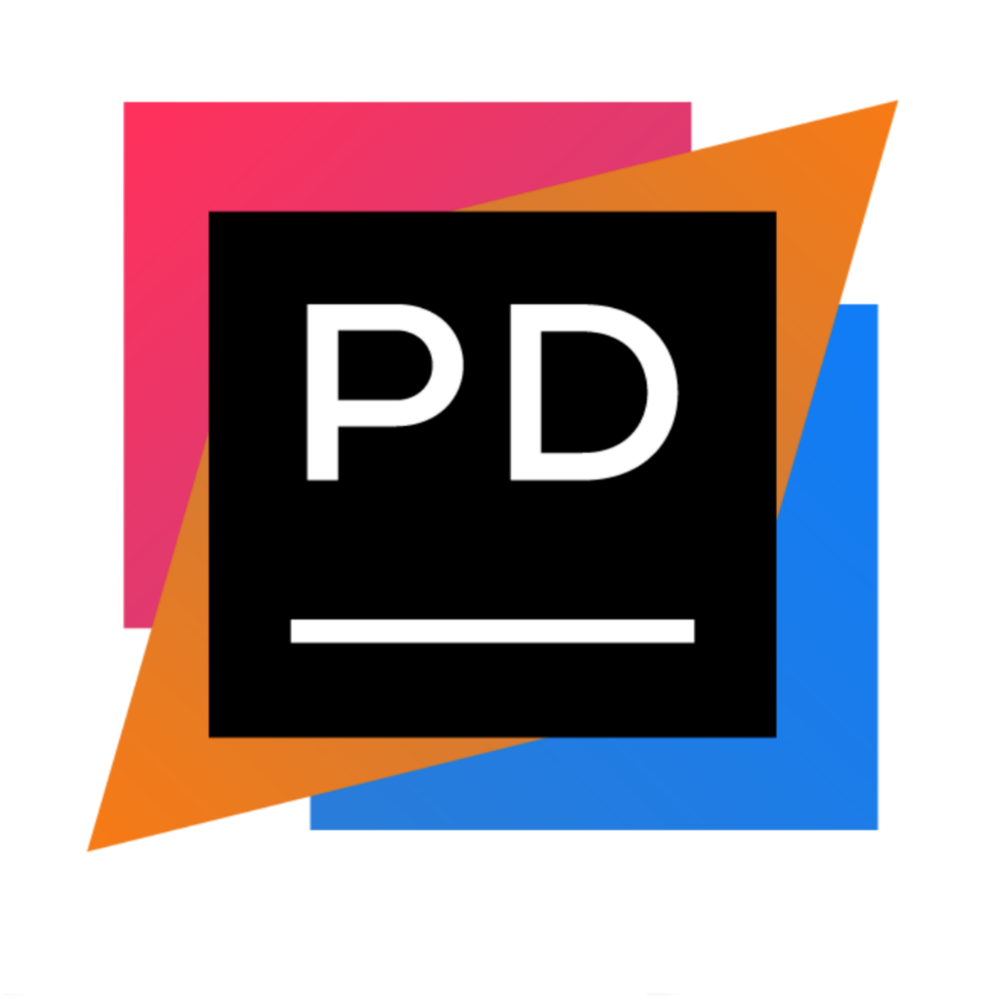

<p align="center"></p>

<h1 align="center">PalaDrill Launcher</h1>

<em><h5 align="center">(formerly Electron Launcher)</h5></em>


<p align="center">Join modded servers without worrying about installing Java, Forge, or other mods. We'll handle that for you.</p>

#### Need Help? [Check the wiki.][wiki]

#### Like the project? Leave a ⭐ star on the repository!

## Downloads

You can download from [GitHub Releases](https://github.com/PalaDrill-Staff/PalaDrill-Launcher/releases)


**Supported Platforms**

If you download from the [Releases](https://github.com/PalaDrill-Staff/PalaDrill-Launcher/releases) tab, select the installer for your system.

| Platform | File |
| -------- | ---- |
| Windows x64 | `PalaDrill-setup-VERSION.exe` |
| macOS x64 | `PalaDrill-setup-VERSION.dmg` |
| macOS arm64 | `PalaDrill-setup-VERSION-arm64.dmg` |
| Linux x64 | `PalaDrill-setup-VERSION.AppImage` |

### Getting Started

**System Requirements**

* [Node.js][nodejs] v16

---

**Clone and Install Dependencies**

```console
> git clone https://github.com/PalaDrill-Staff/PalaDrill-Launcher.git
> cd HeliosLauncher
> npm install
```
**Build Installers**

To build for your current platform.

```console
> npm run dist
```

Build for a specific platform.

| Platform    | Command              |
| ----------- | -------------------- |
| Windows x64 | `npm run dist:win`   |
| macOS       | `npm run dist:mac`   |
| Linux x64   | `npm run dist:linux` |

Builds for macOS may not work on Windows/Linux and vice-versa.

This adds two debug configurations.

#### Debug Main Process

This allows you to debug Electron's [main process][mainprocess]. You can debug scripts in the [renderer process][rendererprocess] by opening the DevTools Window.

#### Debug Renderer Process

This allows you to debug Electron's [renderer process][rendererprocess]. This requires you to install the [Debugger for Chrome][chromedebugger] extension.

Note that you **cannot** open the DevTools window while using this debug configuration. Chromium only allows one debugger, opening another will crash the program.

---

### Note on Third-Party Usage

Please give credit to the original author and provide a link to the original source. This is free software, please do at least this much.

For instructions on setting up Microsoft Authentication, see https://github.com/PalaDrill-Staff/PalaDrill-Launcher/blob/feature/ms-auth/docs/MicrosoftAuth.md.

## Credit
Based on https://github.com/dscalzi/PalaDrill
---
